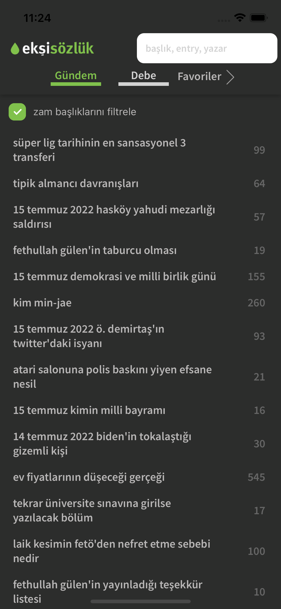
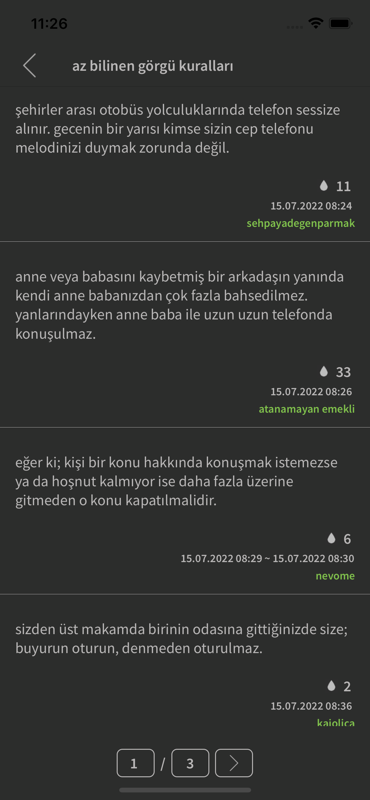
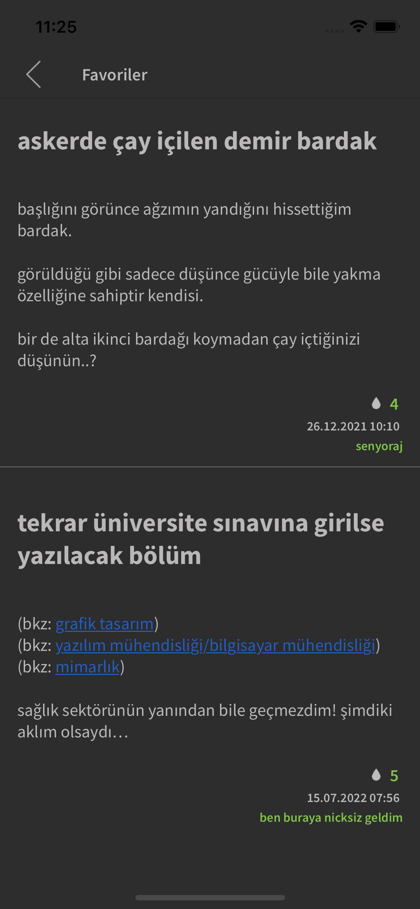
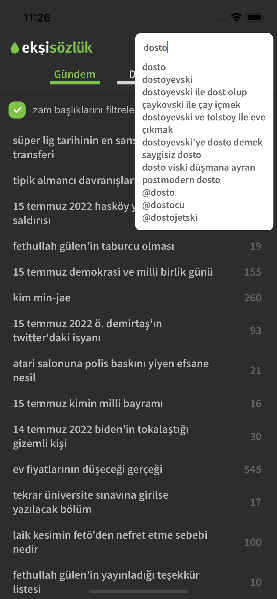

# Eksi App

Eksi App is a mobile app that allows you to search for and read news articles from the [eksisozluk.com](https://eksisozluk.com) website.

### The technologies used in this project

- React Native
- Typescript
- Context API

<div>
         
              
</div>

## Installing

You can clone the project with the command below.

```
git clone https://github.com/absolutezero13/rn-eksi.git
```

Navigate to the rn-eksi folder and run this command:

```
npm install
```
